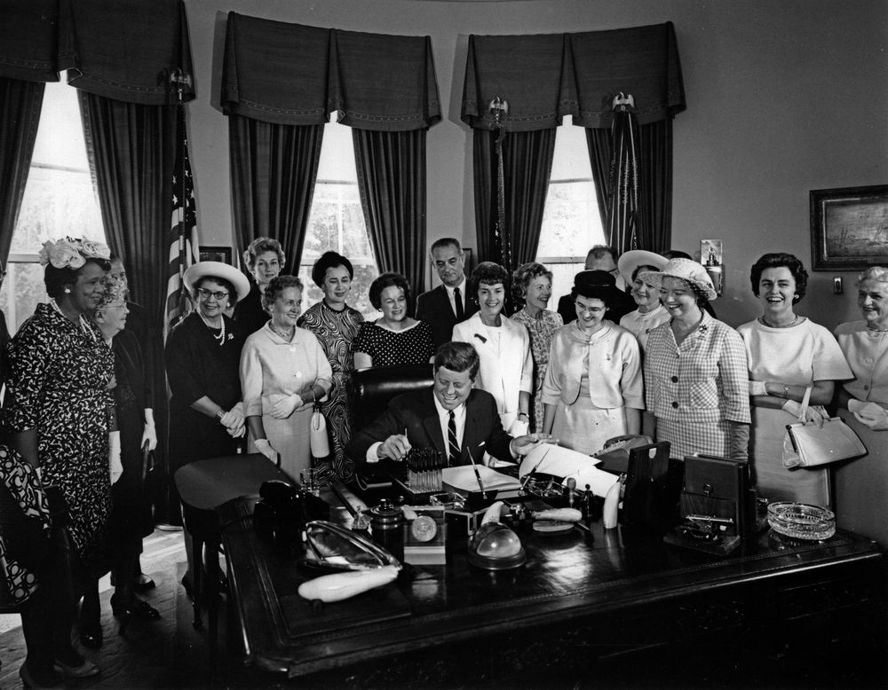
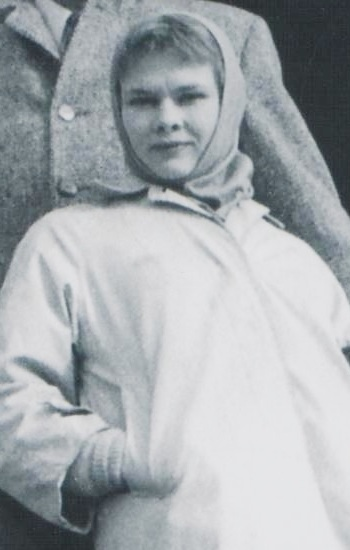
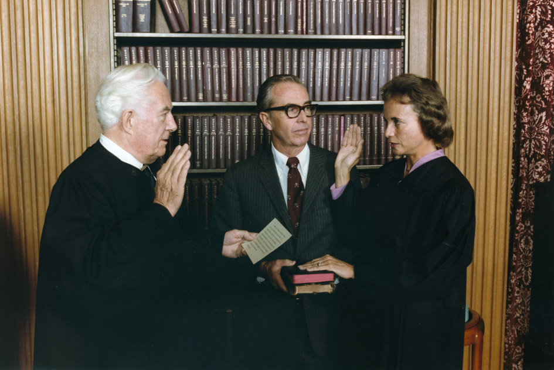
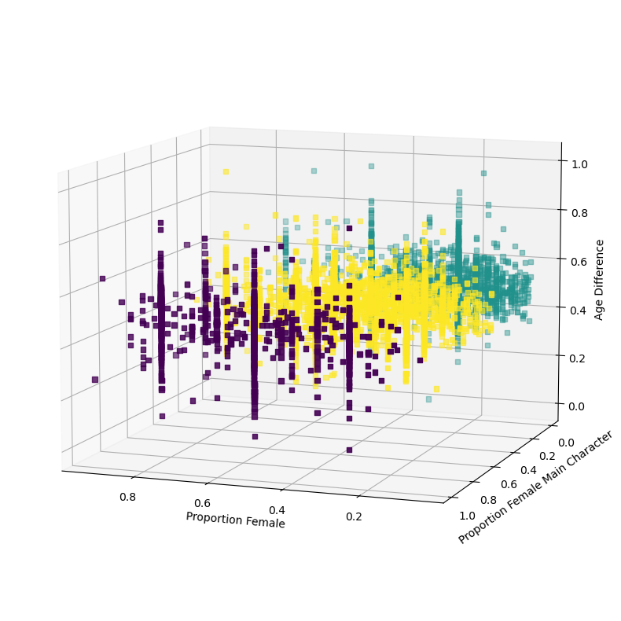
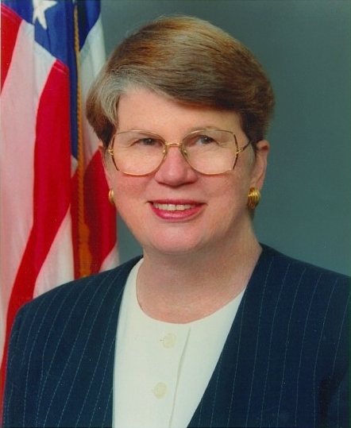

The perception and role of women in the US society has greatly evolved during the past century with women being granted a myriad of new rights. Simultaneously, their perception has also evolved, shifting away from mere housewives. Movies are often seen as a reflection of society, moving along with its ebbs and flows. But has this specific social movement bled into the entertainment industry? Has the depiction of women progressed alongside important milestones in the Feminist movement? Or on the contrary, do stereotypes around women still prevail in Hollywood?

This data story will explore the <a href="http://www.cs.cmu.edu/~ark/personas/"><em>CMU Movie Summary Corpus</em></a> to explore how women are portrayed in Hollywood.

## Over the decades
The proportion of actresses over time gives us a first insight into how well the industry is representing women. According to expert Dr. Martha Lauzen, “Despite the major disruptions in the film business over the last couple of years, onscreen gender ratios have remained relatively stable.”[^1] But what if we compare to 100 years ago, is the picture still as bleak?

<object>
  <iframe frameborder="no" border="0" marginwidth="0" marginheight="0" width="700" height="550" src="html_plots/proportion_men_women.html"></iframe>
</object>

  <a href="html_plots/proportion_men_women.html">Figure 1</a>

Figure 1 shows us that the ratio of women in Hollywood has remained fairly constant over time, staying close to 30% until the 2010s. The 40% mark has been broken for the first time during this decade, getting actresses closer pairing. This increasing trend seems to have started in the 70s, and allows us to fit a regression line to the ratios from the 70s to today. If the industry keeps evolving at this rate, we could naively say that parity would be reached in 2064. If the 70s really were the start of this increase, can it be explained by any significant event in history ? According to our [timeline](https://www.history.com/topics/womens-history/womens-history-us-timeline), the 60s saw the occurrence of two major events for women's rights in the US: the Equal Pay Act and the Civil Rights Act. The Equal Pay Act prohibits a difference of salary based on sex while the Civil Rights Act prohibits (amongst others) employment discrimination based on sex. These two events were a huge step towards gender equality and they might have prompted a change in mentality, resulting in the proportion of women in movies increasing.

<figure class="sidenote">
    
    <figcaption><a href="https://en.wikipedia.org/wiki/Equal_Pay_Act_of_1963"><em>Figure 2.</em></a> Signing of the Equal Pay Act of 1963.</figcaption>
</figure>

### Breakdown of women's representation in movies

Nevertheless, this result doesn't mean that each movie has 30-40% of women in their cast. This result might be biased by movies that have an extremely low or high proportion of women.

<object>
  <iframe frameborder="no" border="0" marginwidth="0" marginheight="0" width="700" height="550" src="html_plots/movie_proportions.html"></iframe>
</object>

  <a href="html_plots/movie_proportions.html">Figure 3</a>

This is what we see with the plot above. In over 40% of movies, actresses make up less than 25% of the cast, meaning that they will spend much of their career outnumbered 3-1 by their male counterparts. Further, 85% of movies have less than 50% of actresses, showing the rarity of female majority casts. So while Figure 1 could lead us to believe that most movies have a 30-40% female cast, Figure 3 may more effectively illustrate what actresses are experiencing during their work. Nonetheless, from 2000 onwards, there is a growing number of movies with a majority of women actors in their cast. Let's break this trend down further by looking into some individual movie genres.

<object>
  <iframe frameborder="no" border="0" marginwidth="0" marginheight="0" width="700" height="550" src="html_plots/movie_proportions_percentages_actress_by_genre.html"></iframe>
</object>

  <a href="html_plots/movie_proportions_percentages_actress_by_genre.html">Figure 4</a>

We see that all genres aren’t equal when it comes to the representation of women. On one hand we have Action, Western and Drama for which over 50% of movies have less than 25% of women in their casts. On the other, three genres seem to do slightly better than the average namely Musical, Adventure and Horror.

### Is the age gap even real? 
> Male actors see their careers peak at the age of 46, female actors reach their professional pinnacles at age 30. - TIME magazine 2015[^2]

<object>
  <iframe frameborder="no" border="0" marginwidth="0" marginheight="0" width="700" height="550" src="html_plots/Average_age_actor.html"></iframe>
</object>

  <a href="html_plots/Average_age_actor.html">Figure 5</a>

 

On average, female actors are **significantly** younger than men at any point throughout the last century. This clearly emphasises the age gap in the industry. Interestingly, the average age of actors increases over time regardless of gender, potentially reflecting the long career span of actors (we see you Judi Dench, keep slayin'). However, even throughout this maturing of the industry, the average age gap does not get any smaller. Have a go playing around with this next animation, showing the complete breakdown of actors' and actresses' ages throughout the decades!

<figure class="sidenote">
  
  <figcaption><a href="https://en.wikipedia.org/wiki/Judi_Dench"><em>Figure 6.</em></a> Judi Dench in 1959. By Stevan Kragujević. </figcaption>
</figure>

<object>
  <iframe frameborder="no" border="0" marginwidth="0" marginheight="0" width="700" height="550" src="html_plots/age_distribution_plot.html"></iframe>
</object>

  <a href="html_plots/age_distribution_plot.html">Figure 7</a>

Now all of this does not tell us in any way **how** women are portrayed in these movies. We've seen that women's representation is increasing but what kind of representation ? 

## We want major roles!
Having a female lead is much more meaningful than adding women only as secondary characters. It is therefore crucial to be able to differentiate the two. 

<object>
  <iframe frameborder="no" border="0" marginwidth="0" marginheight="0" width="700" height="550" src="html_plots/main_char_ratio.html"></iframe>
</object>

  <a href="html_plots/main_char_ratio.html">Figure 8</a>

It is interesting to point out the initial decrease that occurred from the 1910s until the 40s. The lack of data in the 1910s and 1920s could lead to biases, only including a few movies where women portrayed main roles. The confidence interval is indeed the largest around these decades. Furthermore, it could be tempting to say that we start to see an increase starting in the 40s. However this cannot be conclusively said due to the large confidence intervals up until the 1990s. There has been an increase in female main characters in recent decades, but we cannot be sure about when exactly this trend started. Assuming the increase started in the 90s, what events in the 80s could have prompted it?

 

- 1981 :  Sandra Day O’Connor is sworn in by President Ronald Reagan as the first woman to serve in the U.S. Supreme Court.
- 1983 :  Flying on the Space Shuttle Challenger, Sally Ride becomes the first American woman in space.
- 1984 :  Democratic presidential nominee Walter Mondale names Geraldine Ferraro (U.S. House of Representatives) as his running mate, making her the first woman vice president nominee by a major party.
<figure class="sidenote">
  
  <figcaption><a href="https://en.wikipedia.org/wiki/Sandra_Day_O%27Connor"><em>Figure 9.</em></a> Sandra Day O'Connor being sworn in by Chief Justice Warren Burger. From the US National Archive. </figcaption>
</figure>

We thus see women accessing political positions that were so far only occupied by men. Moreover, this decade saw the first American into space. Seeing women accessing jobs that previously seemed out of reach may have impacted society. Therefore, as Hollywood picked up on these cues and wanting to reflect the advancement of mentalities, it portrayed more women in main character roles. In 2022, our analysis suggests that 41.1% of main characters are women, with a 95% confidence interval going up to 42.9%. According to the San Diego State University Center for the Study of Women in Television and Film, females comprised 43.8% of major characters in 2022. [^3] We are not far off! 

<object>
  <iframe frameborder="no" border="0" marginwidth="0" marginheight="0" width="700" height="550" src="html_plots/proportion_main_characters_per_genre.html"></iframe>
</object>

  <a href="html_plots/proportion_main_characters_per_genre.html">Figure 10</a>

When breaking this down further into genres, we see that Adventure and Horror reach similar or even higher ratios than the average while Drama and Action are lagging behind. We cannot draw conclusions on Musical and Western due to their large confidence intervals.

***If you’ve made it so far, that’s great! What have we learned?***

&#x2713; The overall proportion of women has increased in the last 50 years to reach ~40% of actresses.

&#x2713; That does **not** mean that all movies have 40% of women! Some genres have more women than others like Musical or Adventure movies, whereas Westerns or Drama are trailing behind.

&#x2713; The age gap in Hollywood is still a thing and does not seem to be closing down, though the mean age of both men and women in the industry is increasing.

&#x2713; The kind of representation matters, and we do see an increase in women main character roles.

## Can we classify all these movies?

What do you think of when you think of a stereotypical portrayal of a woman ? Does a young pretty actress not contributing to the plot pop into your mind? Being able to classify a movie into stereotypical or non-stereotypical is very valuable in this case. By clustering movies based on the proportion of women, the proportion of women main characters and the difference in the mean ages of men and women in the cast, we were able to cluster all movies into 3 categories. A cluster of stereotypical movies, a cluster of non-stereotypical movies, and finally a cluster that falls somewhere in between.

<figure class="sidenote">
    
    <figcaption>Figure 11. Clustering of Stereotypical and non stereotypical movies.</figcaption>
</figure>

|      cluster      | proportion of women | proportion of women main characters | difference in mean ages |
|-------------------|---------------------|-------------------------------------|-------------------------|
| Non-Stereotypical | 0.531               | 0.978                               | -6.755                  |
| Stereotypical     | 0.321               | 0                                   | -8.079                  |
| Moderate          | 0.398               | 0.461                               | -7.197                  |

  Table 1

The Non-Stereotypical cluster has the highest proportion of women in its casts, as well as in its main characters and it shows the smallest mean age difference. The stereotypical cluster boasts the highest mean age difference, the lowest proportion of actresses and a whopping **0** women playing lead characters. 

What has been the evolution of the release of these 2 types of movies you may ask! 

<object>
  <iframe frameborder="no" border="0" marginwidth="0" marginheight="0" width="700" height="550" src="html_plots/fraction_stereo_movies_per_decades.html"></iframe>
</object>

  <a href="html_plots/fraction_stereo_movies_per_decades.html">Figure 12</a>

From 1920 up to 2020, there seem to always have been a bigger percentage of movies produced that had a stereotypical depiction of women. In the 70s the proportion of stereotypical movies was almost 50% and is the highest in the years analysed. Of course, due to the large confidence intervals that result should be taken with a grain of salt. Interestingly, the proportion of non-stereotypical movies was relatively stable throughout the decades until 2000. From 2000 to 2020 we see a strong increase of the proportion of movies with a non-stereotypical depiction of women to reach approximately the same percentage as stereotypical movies. (YAY!) Going back to our beloved timeline, multiple events where women ascended to a position of power could have prompted this increase, such as the first female attorney general, the first female secretary of state or the first female speaker of the house.

<figure class="sidenote">
    
    <figcaption><a href="https://en.wikipedia.org/wiki/Janet_Reno"><em>Figure 13</em></a>Janet Reno, first female attorney general (1993).</figcaption>
</figure>

Now that we have a way of categorising these movies and we’ve seen the release trends, what genres are overrepresented into our two clusters of interest ? Reminder that previously we saw that 
- Musical
- Adventure
- Horror
  
genres tended to do better in terms of women proportion in their cast. Whereas 
- Action
- Western
- Drama
  
tend to do worse. Now how does that compare to this clustering ? Picture a pie for each cluster. Then imagine that the pies are not the same size. If the difference in Figure 13 is negative, it means that the genre makes up a bigger piece of the stereotypical pie than of the non-stereotypical pie. In technical terms, we normalized the genre counts in each cluster before subtracting. Inversely, if the difference is positive, it means that there is a higher proportion of this movie genre in the non-stereotypical movies. We did not show the genres with an absolute difference smaller than 0.01. 

<object>
  <iframe frameborder="no" border="0" marginwidth="0" marginheight="0" width="700" height="550" src="html_plots/clustering_genre_barplot.html"></iframe>
</object>

  <a href="html_plots/clustering_genre_barplot.html">Figure 14</a>

Action and Western still fall into the category of stereotypical as expected by the previous analysis. Similarly, but on the other side of the spectrum, Horror and Musical are in the  non-stereotypical cluster. Surprisingly, Drama and Adventure are not on the side we would expect. Indeed, we previously saw that Drama had low women representation, but is actually overrepresented into the non-stereotypical cluster, and Adventure has a similar trend but in the opposite direction. 

There are of course limitations with this analysis. Most prevalently, we see that romantic comedies appear in movies that have a non-stereotypical representation of women. However, women are often solely love interests in romantic comedies and are thus portrayed stereotypically. Moreover, romantic comedies usually portray heterosexual couples, so the proportion of men and women actors tends to be close to 50-50, which biases our analysis. This highlights the need to not only look at the proportion of actresses, the proportion of women character, and the age differences but to also consider other factors. More precisely, the **vocabulary** associated to female and male actors in general. This is a perfect segue into our final analysis: *The Vocabulary Analysis* (YAY!)

## Hey kids, spelling is fun! - Let's look at words

As we’ve seen so far, it is not enough to have more women on screen, or even female leads. It is also crucial to understand what kind of leads they’re portraying. This is why we have analysed the word, more specifically verbs adjectives and nouns, associated with each gender throughout the decades. This captures how women are depicted beyond being present and tagged as a main characters.

<label for="plotSelector1">Select a Plot:</label>
<select id="plotSelector1" onchange="loadPlot1()">
    <option value="html_plots/interactive_plot_frequencies_Verbs.html">Verbs</option>
    <option value="html_plots/interactive_plot_frequencies_Adjectives.html">Adjectives</option>
    <option value="html_plots/interactive_plot_frequencies_Nouns.html">Nouns</option>
</select>

<iframe id="plotFrame1" width="100%" height="400px" frameborder="0" src=""></iframe>

  Figure 15

With this visualisation we can observe the top 5 associated verbs, nouns and adjectives for men and women respectively (all genres). While this analysis captures the most commonly associated words, it’s important to note that it may miss changes in less common words, highlighting one of its caveats. We first notice that the words associated to each gender are overall quite constant throughout the decades. More striking is the contrast of words associated with men versus women. Men are highly linked to action related words such as _kill_, _save_ or _soldier_. On the other hand  women are mostly associated with everyday life type of words such as _love_, _marry_ or _family_, or with their appearance like _beautiful_ or _pretty_. So have we really moved away from the housewife representation ?

**In an announcer's voice** One last time, let’s break it down by genres!

<label for="plotSelector2">Select a Plot:</label>
<select id="plotSelector2" onchange="loadPlot2()">
    <option value="html_plots/rel_freq_interactive_Action.html">Action</option>
    <option value="html_plots/rel_freq_interactive_Adventure.html">Adventure</option>
    <option value="html_plots/rel_freq_interactive_Drama.html">Drama</option>
    <option value="html_plots/rel_freq_interactive_Horror.html">Horror</option>
    <option value="html_plots/rel_freq_interactive_Musical.html">Musical</option>
    <option value="html_plots/rel_freq_interactive_Western.html">Western</option>
</select>

<iframe id="plotFrame2" width="100%" height="400px" frameborder="0" src=""></iframe>

  Figure 16

We analyse the 3 most and 3 least stereotypical genres identified by our clustering analysis (Figure 13) and each genre is easily recognizable. For example, action movies with words such as _kill_, _death_ or _battle_, or Westerns with _sheriff_, _ranch_ and _money_, and Horror with _alien_, _supernatural_ or _attack_. However, women both in stereotypical and non-stereotypical movies are associated with _mother_, _young_, _love_ and _beautiful_, regardless of the genre, up until the most recent decades. Thus, women are mostly described based on their physical appearance and their relationship to others instead of having their own personality and being someone even in absence of others. As opposed to men, who have a wider variety of words in every genre and mainly action words such as _kill_ and _party_. Nevertheless, even though we do not dive into it here, men are also stereotypically represented. Instead of real-life words like _father_, _caring_, or _love_, the industry clearly prioritizes strength and an emotional void. It therefore seems like there has been no real improvement in ***how*** women, but also men, are portrayed in the movie industry.

## Final Note
It’s been a wild ride, thank you for tagging along with us! It’s time for a rewind.

&#9733; The representation of women is increasing, but all genres are not made equal.

&#9733; The industry is aging but the age gap shows no signs of shrinking. 

&#9733; While the proportion of female leads is increasing, the vocabulary analysis revealed that there was little improvement in the words associated with women characters.

So should we be hopeless, not at all! We want to leave you with a positive outlook on the future of Hollywood. Indeed, 2023 has been promising for the future of women in the industry. Female led movies can be massive successes! The perfect example of this is the Barbie wave that hit us this summer. Directed by Greta Gerwig and with Margot Robie as the lead, it has been the highest grossing movie in Warner Brothers’ 100-year history with box office sales exceeding $567 million [^4]. Change is incremental and starts with sparks. Who knows... maybe we're just about to light a fire.

# References 
[^1]: [The Hollywood Reporter, *Study Finds Women Represent a Third of Onscreen Population in Film*, 2022](https://www.hollywoodreporter.com/movies/movie-news/women-onscreen-representation-film-study-1235111493/)
[^2]: [TIMES magazine, *This Chart Shows Hollywood’s Glaring Gender Gap*, 2015](https://time.com/4062700/hollywood-gender-gap/)
[^3]: [San Diego State University center for STudy of Women in Television and Film, *Streaming Women: Representation and Employment in Original U.S. Films Released by Streaming Services in 2022*, 2023](https://womenintvfilm.sdsu.edu/research/#:~:text=Females%20comprised%2044%25%20(43.8%25),producers%2C%20editors%2C%20and%20cinematographers.)
[^4]: [Forbes, *Did The Summer of Barbie Save The Movies?*](https://www.forbes.com/sites/georgeschultze/2023/08/24/did-the-summer-of-barbie-save-the-movies/)
